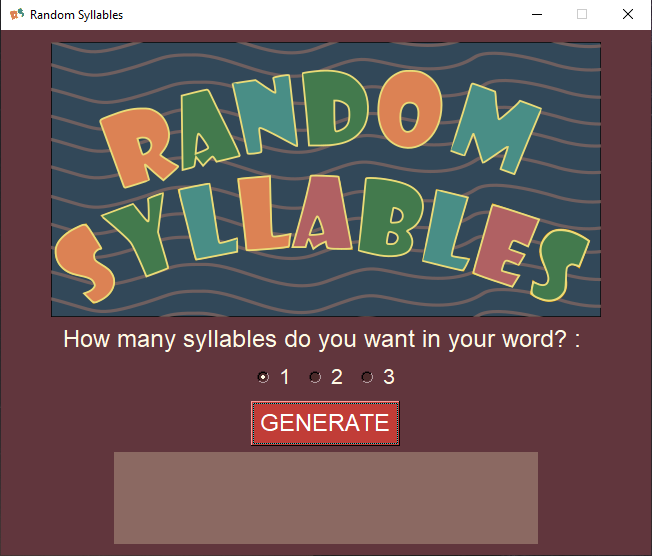

# RandomSyllables

Create random words from randomly chosen syllables!
-
HOW IT WORKS:

Each letter in each syllable is generated by following 4 simple rules:

v = vowel
c = consonant

* rule0 = "vc"
* rule1 = "vcv"
* rule2 = "cv"
* rule3 = "cvc"

The **generate_syllable()** function picks random vowels or consonants
from their own lists. Then passes them to the **generate_word()** function.
Which joins all the syllables together and returns a word.

